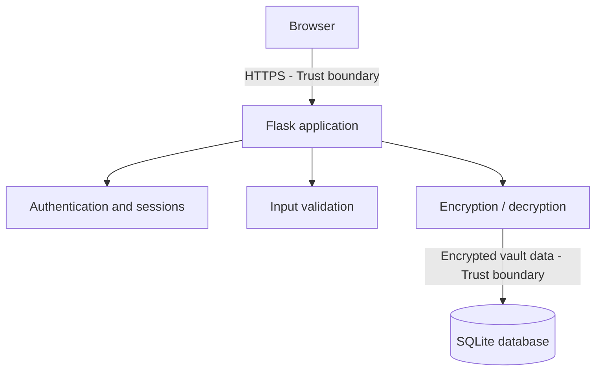

# Checkpoint 1 — Threat Model and Architecture

## 1. System Architecture 

The project will use a simple client-server architecture.

The user will access the password manager from a browser. The browser will communicate with the Flask application using HTTPS.

The Flask application will handle login, sessions, input validation and access to the vault. Encryption and decryption will also happen on the server side before data is stored in the database or returned to the user.

SQLite will be used as the database. It will store user information and encrypted vault entries.

The main trust boundary is between the browser and the server, because anything sent from the client can be modified. Because of this, validation and security checks must be done on the server side. The second trust boundary is between the application and the database.

## 2. Threat Model

For the threat model I focused mostly on the attacks we covered during the first four weeks. The main idea is that anything coming from the browser can be changed, so the server should not trust client-side checks.

| Threat | OWASP mapping | What can happen | Planned protection |
|---|---|---|---|
| Client-side validation bypass | A06: Insecure Design | An attacker can change form values or send a request directly without using the normal page. | Important checks will also be done on the server side. |
| Parameter tampering | A01: Broken Access Control | A user can change an ID in a request and try to access another user's vault entry. | The server will check who owns the requested entry before returning or changing it. |
| HTML injection | A05: Injection | User input can be rendered as HTML and change the page content. | User input will be validated and escaped before it is shown on the page. |
| Stored XSS | A05: Injection | Malicious JavaScript can be saved inside a vault field and execute later when the page is opened. | Jinja escaping will be used and user input will not be rendered as raw HTML. |
| Reflected XSS | A05: Injection | Malicious input from a request or URL can be returned in the page and executed in the browser. | Values coming from the user will be escaped before being added to the response. |
| DOM-based XSS | A05: Injection | Client-side JavaScript can insert unsafe user-controlled data into the page. | Unsafe functions like `innerHTML` will be avoided for untrusted data. |
| Session cookie theft | A07: Authentication Failures | If the session cookie is exposed, another person could use the same session. | Cookies will use `HttpOnly`, `Secure` and `SameSite`. |
| Session fixation | A07: Authentication Failures | An attacker could try to make the victim use a session ID already known to the attacker. | The session ID will be changed after successful login. |
| Insecure HTTP connection | A04: Cryptographic Failures | Login data or session information could be intercepted while travelling between browser and server. | The application will use HTTPS/TLS. |

## 3. Cryptographic Design

The master password will not be stored directly.

When the user logs in, the master password together with a random salt will be passed through Argon2id. The result will be used as the encryption key for the user's vault.

From what I remember from the Cryptography course, AES-256-GCM is a strong option as long as it is used correctly. It also protects the integrity of the encrypted data, and the nonce must not be reused with the same key.

Vault entries will be encrypted on the server side using AES-256-GCM before they are stored in the database. The sensitive fields of a vault entry, such as username, password and notes, will be encrypted.

The database will store the encrypted vault data, the user's salt and a unique nonce for each encrypted entry. The master password and the derived encryption key will not be stored in the database.

The derived key should only exist temporarily on the server while the user has an active session. It will be removed when the user logs out or the session expires.

## 4. Authentication and Session Model

The user will log in with a username and master password. A separate Argon2id hash of the master password will be stored for authentication, so the master password itself does not need to be stored.

After a successful login, the server will create a new random session ID. The session will be stored on the server side, while the browser will only receive the session ID in a cookie.

The session cookie will use `HttpOnly`, `Secure` and `SameSite=Strict`. `HttpOnly` prevents JavaScript from reading the cookie, `Secure` means it will only be sent over HTTPS, and `SameSite=Strict` helps reduce cross-site requests.

The session ID will be regenerated after login to prevent session fixation. When the user logs out, the session will be invalidated on the server and the cookie will be removed.

For the first version, the session will expire after 30 minutes of inactivity. MFA is not planned for the first version, but it can be added later.