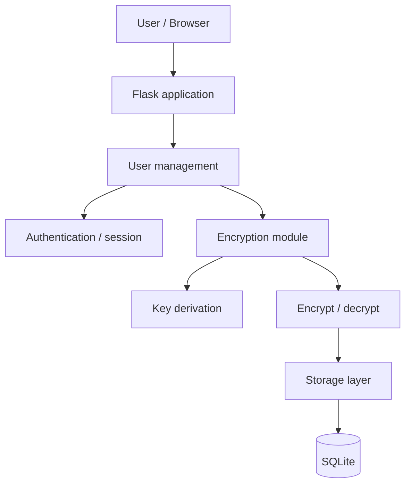

# Threat Model and Architecture

The project is a web-based password manager built with Python and Flask.

The same project is used for ICS0027 Web Application Security and ICS0022 Secure Programming. This document focuses on the secure programming side of the project: cryptography, password and key handling, storage and memory.

## 1. Architecture

For the first version I want to keep the architecture simple. The main parts are the user-management module, encryption module and storage layer. Flask connects these parts and handles the web side of the application.

### 1.1 User-management module

This part will handle registration, login, logout and user sessions.

The master password will not be stored directly. During registration, an Argon2id hash will be created and stored in the database. During login, the entered password will be checked against this hash.

After successful login, the master password can also be used to derive the key needed to decrypt the user's vault.

The exact way the derived key will be kept during an active session still needs to be decided during implementation.

### 1.2 Encryption module

The encryption module will contain the cryptographic logic.

Its main tasks will be:

* deriving an encryption key from the master password;
* encrypting vault entries before they are stored;
* decrypting entries when the user opens them;
* handling the salts and nonces required by the cryptographic scheme.

For vault encryption I currently plan to use AES-256-GCM.

I want to keep the encryption logic separate from the database code. This reduces the chance of accidentally sending plaintext vault passwords directly to storage.

### 1.3 Storage layer

SQLite will be used for storage.

The database will contain user account information and encrypted vault entries. It will also contain values that are needed later for decryption, for example salts and nonces.

Sensitive vault fields should already be encrypted before they are passed to the storage layer.

The database should not contain:

* the plaintext master password;
* plaintext vault passwords;
* plaintext notes;
* the derived vault encryption key.

### 1.4 Data flow

The planned login and vault access flow is:

1. The user sends a username and master password to the Flask application.
2. The user-management part verifies the password using the stored Argon2id hash.
3. If authentication succeeds, a vault encryption key can be derived from the master password.
4. The storage layer loads the encrypted vault entry from SQLite.
5. The encryption module decrypts the requested entry.
6. The plaintext data is used only while it is needed by the application.
7. If an entry is created or changed, it is encrypted before it is written to the database.

The reason for separating these parts is to avoid mixing authentication, encryption and database access in the same code.

Plaintext passwords and encryption keys still need to exist in memory while they are being used, but they should not be written to persistent storage or application logs.

## 2. Threat Model

The main areas considered in the threat model are the master password, the vault at rest, the vault in memory and the web interface.

| Threat                               | What could happen                                                                                                      | Planned mitigation                                                                                                            |
| ------------------------------------ | ---------------------------------------------------------------------------------------------------------------------- | ----------------------------------------------------------------------------------------------------------------------------- |
| Weak master password                 | A weak password could be guessed or brute-forced.                                                                      | The application will require a reasonable minimum password length and Argon2id will be used to make password guessing slower. |
| Master password stored in plaintext  | If the password is accidentally saved in the database or logs, it could be recovered later.                            | The plaintext master password will not be stored. Only an Argon2id hash will be stored for authentication.                    |
| Offline password guessing            | If someone gets a copy of the database, they could try passwords locally without using the application.                | Argon2id with a random salt will be used to make every password guess more expensive.                                         |
| Vault database is stolen             | If vault entries were stored in plaintext, anyone with the database file could immediately read the saved credentials. | Vault entries will be encrypted before they are written to SQLite.                                                            |
| Encrypted vault data is modified     | Someone with access to the database could try to change the ciphertext.                                                | AES-GCM provides integrity checking, so modified encrypted data should fail verification during decryption.                   |
| AES-GCM nonce reuse                  | Reusing the same nonce with the same key can make GCM insecure.                                                        | A new nonce will be generated for every encryption operation and must not be reused with the same key.                        |
| Plaintext vault data stays in memory | After decryption, passwords and other sensitive fields exist in process memory for some time.                          | Plaintext data will be kept only for as long as it is needed and unnecessary copies will be avoided.                          |
| Encryption key stays in memory       | The derived encryption key can remain in memory longer than necessary.                                                 | The key will not be stored permanently and its lifetime in memory should be kept as short as possible.                        |
| Invalid or modified requests         | A user could change request values manually instead of using the normal web forms.                                     | Important validation and authorization checks will be done on the server side.                                                |
| SQL injection                        | User-controlled values could be used to change the meaning of a database query.                                        | Database queries will use parameters instead of directly joining user input into SQL strings.                                 |
| XSS through vault fields             | HTML or JavaScript could be saved in a vault field and later execute when the entry is displayed.                      | Jinja2 escaping will be used and vault data will not be rendered as raw HTML.                                                 |
| Access to another user's vault entry | A user could change an entry ID in a request and try to access another user's data.                                    | The server will check that the requested entry belongs to the logged-in user.                                                 |

## 3. Vault and Cryptographic Design

For the first version, I plan to encrypt each vault entry as one block instead of encrypting every field separately.

Before encryption, an entry can contain:

* website or service name;
* username;
* password;
* notes.

These values can be stored in a small JSON object and then encrypted together.

This is simpler for the first version of the project and avoids having separate encryption metadata for every field.

The database can then store information such as:

* entry ID;
* user ID;
* ciphertext;
* nonce;
* other metadata required for decryption.

### 3.1 Master password

The master password has two different purposes in this design.

The first purpose is authentication.

For this, an Argon2id password hash will be stored in the database. When the user logs in, the entered master password will be checked against this stored hash.

The second purpose is deriving the vault encryption key.

I do not want to use the stored authentication hash directly as the AES key. Instead, a separate Argon2id operation with its own random salt will be used to derive a 256-bit key from the entered master password.

The derived encryption key itself will not be stored in the database.

### 3.2 Vault encryption

The vault entries will be encrypted using AES-256-GCM.

I have used AES-CBC before in the Cryptography course, but for this project I plan to use GCM because the password manager also needs to detect if encrypted data was modified.

AES-GCM provides encryption together with integrity checking.

A new nonce will be generated for every encryption operation. The nonce does not need to be secret, so it can be stored together with the ciphertext.

The important requirement is that the same nonce must not be reused with the same encryption key.

The database will store the encrypted vault entries, the salt used for key derivation and the metadata required for AES-GCM decryption.

It will not store:

* the plaintext master password;
* plaintext vault entries;
* the derived encryption key.

### 3.3 Memory handling

Memory handling is one part of the design that I still need to investigate more during implementation.

After an entry is decrypted, its password and other sensitive data have to exist somewhere in memory. The same is true for the derived encryption key.

With Python, it is not easy to control exactly when objects such as strings or bytes are removed or overwritten in memory. Because of this, simply deleting a variable does not guarantee that the sensitive data is immediately gone.

For the first implementation, the main approach will be to keep plaintext data and encryption keys in memory for as little time as possible and avoid unnecessary copies.

I do not consider secure memory wiping fully solved at this stage. This will depend partly on how Python and the cryptographic library handle sensitive values internally.
